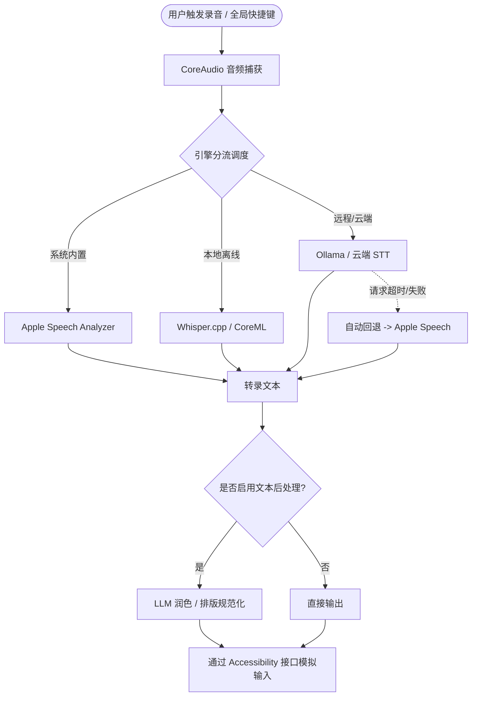

# 🎙️ FluidVoice

<p align="center">
  <b>面向 macOS 的本地语音听写与大模型文本后处理工具</b>
  <br />
  <i>On-device Speech-to-Text and LLM Post-Processing for macOS</i>
</p>

<p align="center">
  <a href="https://github.com/xiangsam/FluidVoice/releases/latest"></a>
  <a href="https://github.com/xiangsam/FluidVoice/blob/main/LICENSE"></a>
  <a href="https://github.com/xiangsam/FluidVoice"></a>
</p>

---

## 概述

FluidVoice 是一个基于 SwiftUI 开发的 macOS 语音听写与文本后处理工具，Fork 自开源项目 [altic-dev/FluidVoice](https://github.com/altic-dev/FluidVoice)。

本项目在原项目基础上进行了中文本地化与功能扩展，主要包含以下内容：
- **中文语言支持**：完整的界面中文本地化与多语种配置。
- **扩展转写引擎**：支持 Apple Speech Analyzer、Whisper (`whisper.cpp`)、Qwen3-ASR (CoreML) 以及局域网/云端 Ollama STT 服务。
- **故障回退机制**：当网络或远程服务不可用时，自动回退至本地语音引擎完成转录。
- **LLM 文本后处理**：集成大语言模型，用于语气词过滤、标点规范化及格式整理。
- **内存与上下文管理**：支持根据录音时长动态配置 ASR 上下文与 KV Cache，提供实时的内存占用评估。

---

## 核心功能

### 1. 语音转文字引擎 (Speech-to-Text)
- **Apple 原生引擎**：支持 macOS 15+ / 26+ 的 `Speech Analyzer` 及系统内置语音识别，无需常驻模型内存。
- **本地离线模型**：
  - **Whisper**（支持 Large-Turbo / Large-V3 / Medium / Small / Base 等 GGUF 格式）。
  - **Qwen3-ASR**（基于 CoreML 状态化解码，适配 Apple Silicon）。
  - **FluidAudio 神经网络模型**（Parakeet 等）。
- **远程 / 局域网服务**：支持配置局域网 Ollama 实例或兼容 OpenAI 格式的云端 STT API。

### 2. LLM 文本后处理
- **预设文本清洗**：去除口语停顿词、修正倒装句、统一中英文混排空格与标点符号。
- **多后端支持**：支持本地 Ollama、OpenAI API 兼容接口、Groq、DeepSeek 等服务。
- **Prompt 配置**：支持自定义系统 Prompt 与实时效果预览。

### 3. 容灾回退
- 远程或云端 STT 请求超时或异常时，自动回退到本地 Apple 引擎重新处理音频，避免转录中断。

---

## 架构简图



---

## 安装与构建

### 下载预编译版本
可前往 [Releases](https://github.com/xiangsam/FluidVoice/releases) 下载最新的应用安装包。

### 源码编译

**环境要求**：
- macOS 15.0 或更高版本
- Xcode 16.0+ 或 Xcode Command Line Tools

```bash
# 1. 克隆代码仓库
git clone https://github.com/xiangsam/FluidVoice.git
cd FluidVoice

# 2. 编译 Release 版本
./build.sh release

# 3. 运行应用程序
open DerivedData/Build/Products/Release/FluidVoice.app
```

---

## 模型与后端支持

| 分类 | 引擎 / 模型 | 适用场景 | 网络需求 | 支持架构 |
| :--- | :--- | :--- | :--- | :--- |
| **系统内置** | Apple Speech Analyzer | 快速听写、零资源常驻 | 离线 | macOS 15+ / Apple Silicon |
| **系统内置** | Apple Speech (经典) | 系统级语音识别 | 离线 | 通用 |
| **本地模型** | Whisper (Large-Turbo / Small 等) | 高准确率本地离线识别 | 首次下载后离线 | Apple Silicon / Intel |
| **本地模型** | Qwen3-ASR | 中文及多方言本地识别 | 首次下载后离线 | Apple Silicon |
| **远程服务** | Ollama STT | 局域网私有化服务器转录 | 局域网 | 支持 Ollama 的设备 |
| **云端 API** | OpenAI / Groq 等 | 云端批量或高并发识别 | 互联网 | 通用 |

---

## 快捷键说明

- **听写模式**：默认快捷键为 `Right Option (⌥)`，按住说话或单击开始/结束。
- **改写模式**：选中文本后按 `Shift + Right Option`，调用大模型对选中内容进行重写。
- **取消**：按 `Escape` 键取消当前录音。

---

## 参考与依赖

本项目基于以下开源项目构建：
- [altic-dev/FluidVoice](https://github.com/altic-dev/FluidVoice)
- [whisper.cpp](https://github.com/ggerganov/whisper.cpp)
- [FluidAudio](https://github.com/altic-dev/FluidAudio)
- [Ollama](https://ollama.com)

---

## 许可证

本项目遵循 [GPL-3.0 License](LICENSE)。
