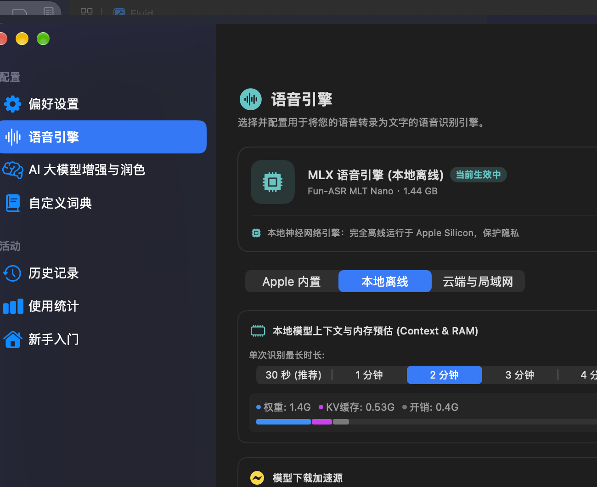
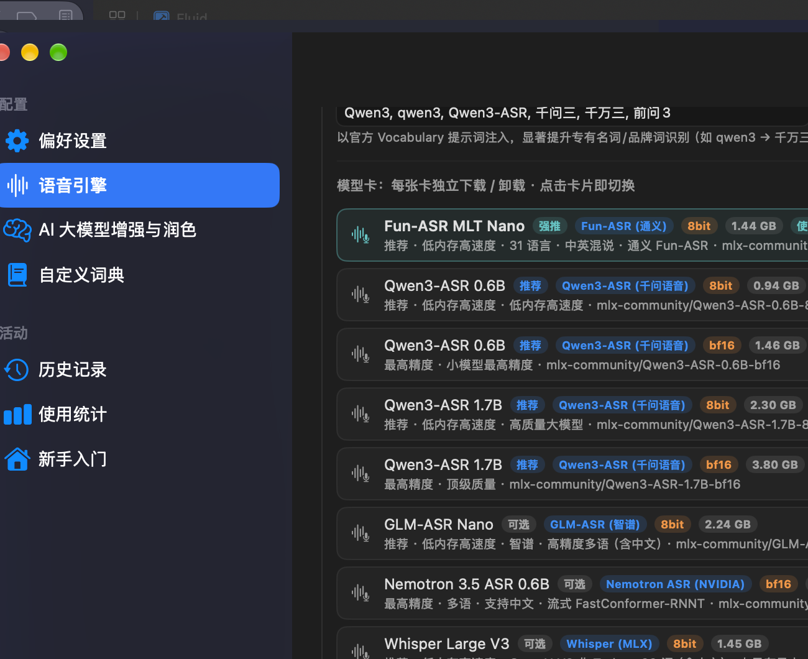
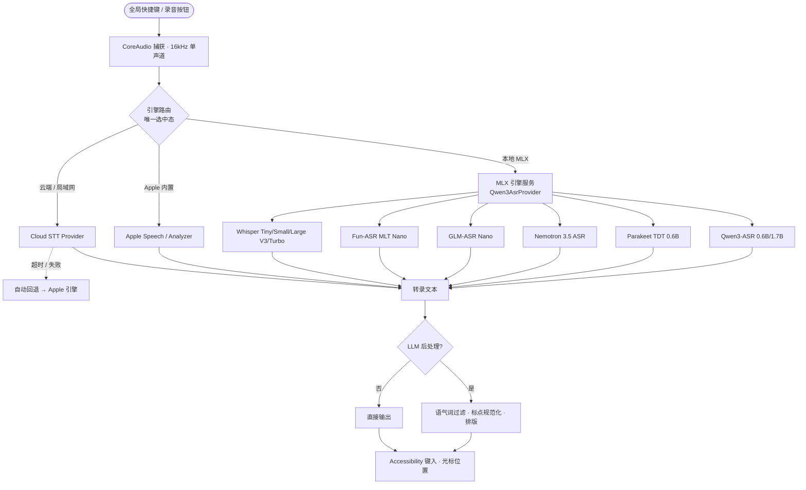

# 🎙️ FluidVoice

<p align="center">
  <b>原生 Swift + MLX 架构的 macOS 语音听写工具</b>
  <br />
  <i>Native Swift · MLX On-Device Speech-to-Text · Cloud STT · LLM Post-Processing for macOS</i>
</p>

<p align="center">
  <a href="https://github.com/xiangsam/FluidVoice/releases/latest"></a>
  <a href="https://github.com/xiangsam/FluidVoice/blob/main/LICENSE"></a>
  <a href="https://github.com/xiangsam/FluidVoice"></a>
  <a href="https://github.com/ml-explore/mlx-swift"></a>
  <a href="https://github.com/xiangsam/FluidVoice"></a>
</p>

---

## ✨ 项目亮点

FluidVoice 是一个 **100% 原生 SwiftUI + MLX 架构** 的 macOS 语音听写工具。所有本地模型都运行在 Apple Silicon 的 **MLX 引擎** 上——不依赖 transcribe.cpp、不依赖 CoreML 包装、不依赖 Python 运行时，纯净的 Swift 实现。

- **🍎 原生 Swift MLX 架构** —— 离线模型全部由自研 `Sources/Fluid/Engines/` 下的 MLX Swift 引擎驱动（Qwen3-ASR / Parakeet / Nemotron / GLM / Fun-ASR / Whisper 六大引擎），直接调用 `mlx-swift`，无任何桥接层。
- **📦 六大离线模型家族，一键下载切换** —— 模型卡 UI：下载、卸载、切换独立进行，互不干扰。
- **☁️ 云端 STT 开箱即用** —— OpenRouter / OpenAI / Groq / Ollama / 自定义端点，支持动态模型扫描（OpenRouter 仅列真实 STT 模型）。
- **🥇 推荐体系** —— 根据真实体验标注推荐等级：Fun-ASR 中英混说强推、Qwen3-ASR 推荐、Whisper 99 语含中文、Parakeet 仅欧洲语系（标注「不支持中文」）。
- **🛟 智能容灾回退** —— 云端超时/异常时自动切换到本地 Apple 引擎，录音永不丢失。
- **🧠 LLM 文本后处理** —— 语气词过滤、标点规范化、排版整理，支持 Ollama / OpenAI / Groq / DeepSeek / OpenRouter。
- **🎛️ 内存与上下文管理** —— 动态 ASR 上下文（30s ~ 5min）+ KV Cache 估算，实时显示内存占用。
- **⌨️ 全局热键听写** —— 按住说话 / 单击切换，听写 / 改写 / 取消 / 粘贴上次转写一应俱全。

---

## 📸 截图

| 语音引擎总览 | MLX 本地模型卡 |
| :---: | :---: |
|  |  |

*MLX 引擎区展示推荐徽章：「强推」Fun-ASR、「推荐」Qwen3-ASR、「可选」Whisper/GLM/Nemotron、「不支持中文」Parakeet。*

---

## 🏗️ 架构

### 引擎分层



### 核心目录

```
Sources/Fluid/
├── Engines/                  # 自研 MLX Swift 推理引擎（全部 Apple Silicon 原生）
│   ├── Qwen3Mlx/             # Qwen3-ASR 0.6B/1.7B · 8bit/bf16
│   ├── ParakeetMlx/          # NVIDIA Parakeet TDT (25 欧洲语言)
│   ├── NemotronMlx/          # NVIDIA Nemotron 3.5 ASR
│   ├── GlmMlx/               # 智谱 GLM-ASR Nano
│   ├── FunMlx/               # 通义 Fun-ASR MLT Nano
│   └── WhisperMlx/           # OpenAI Whisper (MLX 架构)
├── Services/
│   ├── Qwen3AsrProvider.swift # MLX 引擎服务（六大家族统一调度）
│   ├── CloudTranscriptionProvider.swift # OpenRouter/OpenAI/Groq/Ollama
│   └── ASRService.swift       # 引擎路由 · 智能回退
└── UI/AISettings/
    └── NativeVoiceEngineSettingsView.swift # 模型卡 UI · 推荐体系
```

---

## 🎯 引擎与模型支持

### 本地离线（全部 MLX · Apple Silicon）

| 模型家族 | 规格 | 语言 | 推荐等级 |
| :--- | :--- | :--- | :--- |
| **Fun-ASR MLT Nano** | 8bit（1.44 GB） | 31 语 · 中英混说 | 🟢 强推 |
| **Qwen3-ASR** | 0.6B 8bit/bf16 · 1.7B 8bit/bf16 | 30 语 | 🔵 推荐 |
| **Whisper** | Tiny/Small · Large V3 · Large V3 Turbo | 99 语（含中文） | ⚪ 可选 |
| **GLM-ASR Nano** | 8bit（2.4 GB） | 多语（含中文） | ⚪ 可选 |
| **Nemotron 3.5 ASR** | 0.6B bf16 | 多语（含中文）· 流式 | ⚪ 可选 |
| **Parakeet TDT 0.6B v3** | bf16（2.5 GB） | 25 语言 · **仅欧洲语系** | 🟠 不支持中文 |

### Apple 内置
- **Apple Speech Analyzer**（macOS 26+）：系统级高精度识别，零内存常驻
- **Apple Speech（Legacy）**：经典系统识别引擎

### 云端 / 局域网（OpenAI 兼容）

| 服务 | 端点 | 模型列表 |
| :--- | :--- | :--- |
| **OpenRouter** | `openrouter.ai/api/v1` | ✅ 动态扫描（仅列真实 STT 模型） |
| **OpenAI** | `api.openai.com/v1` | 手动输入（whisper-1 等） |
| **Groq** | `api.groq.com/openai/v1` | 手动输入 |
| **Ollama** | 局域网实例 | ✅ 动态扫描（/api/tags） |
| **自定义** | OpenAI 兼容端点 | 手动输入 |

---

## 🪄 模型卡 UI

每个模型一张卡：**下载 / 卸载 / 切换**独立进行。点击卡片即切换引擎；选中态全局唯一——本地 MLX 卡、Apple 内置、云端卡之间严格互斥，同一时刻只有一张卡处于选中态。

- **推荐徽章**：强推（绿）/ 推荐（蓝）/ 可选（灰）/ 不支持中文（橙）
- **状态徽章**：量化规格（8bit/bf16）、体积、「使用中」实时标记
- **扫描节点模型**：Ollama / OpenRouter 一键拉取真实模型列表

---

## 🛠️ 安装与构建

### 环境要求
- macOS 15.0+（Apple Silicon）
- Xcode 16.0+ 或 Xcode Command Line Tools

### 源码编译

```bash
git clone https://github.com/xiangsam/FluidVoice.git
cd FluidVoice

# Release 构建
xcodebuild -project Fluid.xcodeproj -scheme Fluid \
  -configuration Release -destination 'platform=macOS' build

# 运行
open DerivedData/Build/Products/Release/FluidVoice.app
```

### 模型下载
模型通过 `hf-mirror.com`（国内镜像）加速下载，可在设置页切换镜像源。首次下载后**完全离线**运行。

---

## ⌨️ 快捷键

| 功能 | 默认快捷键 |
| :--- | :--- |
| 听写（按住说话 / 单击切换） | `Right Option (⌥)` |
| 改写（选中文本后语音指令） | `Shift + Right Option` |
| 取消当前录音 | `Escape` |

---

## 📦 依赖

- [mlx-swift](https://github.com/ml-explore/mlx-swift) —— Apple Silicon 机器学习框架
- [FluidAudio](https://github.com/altic-dev/FluidAudio) —— 音频捕获（CoreAudio）
- [DynamicNotchKit](https://github.com/altic-dev/DynamicNotchKit) —— 灵动岛式听写反馈 UI

---

## 📄 许可证

本项目遵循 [GPL-3.0 License](LICENSE)。
