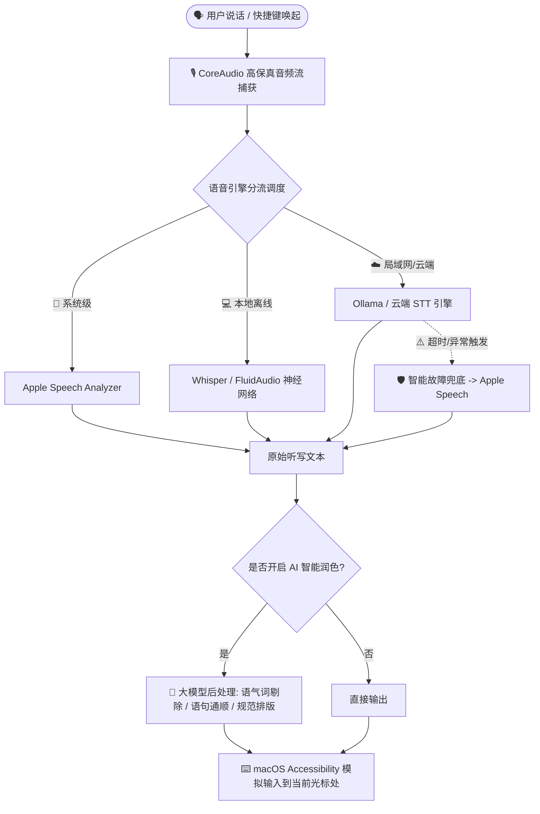

# 🎙️ FluidVoice (流式语音助手)

<p align="center">
  <b>极速、私密、优雅的 macOS 原生 AI 语音听写与大模型智能润色助手</b>
  <br />
  <i>Next-generation on-device Speech-to-Text & LLM post-processing for macOS</i>
</p>

<p align="center">
  <a href="https://github.com/xiangsam/FluidVoice/releases/latest"></a>
  <a href="https://github.com/xiangsam/FluidVoice/blob/main/LICENSE"></a>
  <a href="https://ollama.com"></a>
  <a href="https://github.com/xiangsam/FluidVoice"></a>
</p>

---

## 🌟 核心特色 (Key Highlights)

### 1. ⚡ 全系列语音引擎支持 (Multi-Engine STT Matrix)
- **🍏 Apple 现代内置引擎**：零下载、零内存占用，原生支持 macOS 26+ 现代流式 `Speech Analyzer` 与经典 `SFSpeechRecognizer`。
- **💻 本地离线高精度引擎**：
  - **Whisper 全系列**（基于 `whisper.cpp`，支持 Large-Turbo / Large-V3 / Medium / Small / Base / Tiny，完全离线高精度）。
  - **FluidAudio 神经网络模型**（针对 Apple Silicon 深度优化，包括 Parakeet TDT、Nemotron、Qwen3-ASR）。
- **☁️ Ollama 局域网与私有云大模型**：支持将家庭/公司局域网内部署的 Ollama 服务器作为语音转录后端，极速利用远程算力。

### 2. 🧠 AI 大模型文本智能润色 (LLM Post-Processing)
- 语音识别完成后，自动将原始口语文字交由大模型二次加工：
  - 🧹 **去除语气词与杂音**：自动剔除“呃、啊、然后、那个”等冗余停顿词。
  - ✍️ **口语转标准书面语**：理顺长句倒装、纠正口语语病，输出得体公文/邮件/报告。
  - 🔤 **中英文排版规范化**：自动在中文与英文/数字间补充空格，规范标点符号。
  - 💻 **编程与专业代码词识别**：智能匹配驼峰命名、函数名、API 与技术专业术语。
  - ⚙️ **自定义 Prompt Playground**：支持实时对比改写前后的效果与自由编写 System Prompt。
- 支持 **Ollama 本地大模型**、**DeepSeek**、**OpenRouter**、**Groq**、**OpenAI** 等多种提供商。

### 3. 🛡️ 智能容灾与故障兜底 (Smart STT Fallback)
- 当开启远程 Ollama 或云端 API 模式时，如果遇到局域网掉线、服务器高负载超时或认证错误，系统将在指定超时内**毫秒级自动平滑回退至 Apple 本地语音引擎**完成转录。
- **彻底告别长语音录制失败的挫败感**，保障每一次说话都有稳定输出。

### 4. 🎨 100% 原生 macOS HIG 现代界面
- 采用 macOS 现代设计规范：全中文本地化、通透的毛玻璃卡片体系、刘海屏 Notch 灵动岛悬浮条、全局毫秒级全局快捷键唤起。
- 拥有打字速度 (WPM) 与今日节省时间生产力统计、个性化发音纠错词典。

---

## 🏗️ 架构概览 (Architecture)



---

## 🚀 快速上手 (Quick Start)

### 方式一：直接下载发布包 (Recommended)
1. 前往 [Releases](https://github.com/xiangsam/FluidVoice/releases) 下载最新的 `FluidVoice.dmg` 或 `FluidVoice.app.zip`。
2. 解压并拖动到 `/Applications`（应用程序）文件夹。
3. 打开应用，根据引导授予**麦克风**与**辅助功能**权限。

### 方式二：从源码本地编译

```bash
# 1. 克隆代码仓库
git clone https://github.com/xiangsam/FluidVoice.git
cd FluidVoice

# 2. 一键编译并签名 Release 版本
./build.sh release

# 3. 运行应用程序
open DerivedData/Build/Products/Release/FluidVoice.app
```

---

## ⚙️ 模型与后端支持一览 (STT Models & Providers)

| 分类 | 引擎 / 模型 | 适用场景 | 网络需求 | 硬件要求 |
| :--- | :--- | :--- | :--- | :--- |
| **Apple 内置** | Apple Speech Analyzer | 零下载即开即用、日常快速记录 | 纯离线 | macOS 15+ / 26+ |
| **Apple 内置** | Apple Speech (经典) | 系统内置多语言识别 | 纯离线 | 所有 Mac 机型 |
| **本地离线** | Whisper Large Turbo | 顶尖中文/英文识别准确率，极快推理 | 需首次下载 | Apple Silicon |
| **本地离线** | Whisper Small / Base | 轻量省电，适合低功耗或老款 Mac | 需首次下载 | Apple Silicon / Intel |
| **本地离线** | FluidAudio Parakeet | 针对 M 系列芯片神经网络深度加速 | 需首次下载 | Apple Silicon |
| **局域网/私有云** | Ollama STT | 调用家庭服务器/公司算力私有化转录 | 局域网 | 支持 Ollama 的设备 |
| **云端 API** | OpenAI / Groq / OpenRouter | 云端超高并发高精度转录 | 需要外网 | 所有 Mac 机型 |

---

## ⌨️ 常用快捷键 (Default Shortcuts)

- **主听写模式 (Dictate)**：按住或点按 `Right Option (⌥)` 触发录音，松开或再次按下自动完成转录并键入。
- **改写润色模式 (Rewrite)**：选中文本后按下 `Shift + Right Option`，选中的内容将被大模型重写并替换。
- **取消录音**：按 `Escape` 键随时丢弃当前音频。

---

## 📄 开源许可证 (License)

本项目采用 [GPL-3.0 License](LICENSE) 开源。欢迎提交 Pull Request 和 Issue！
